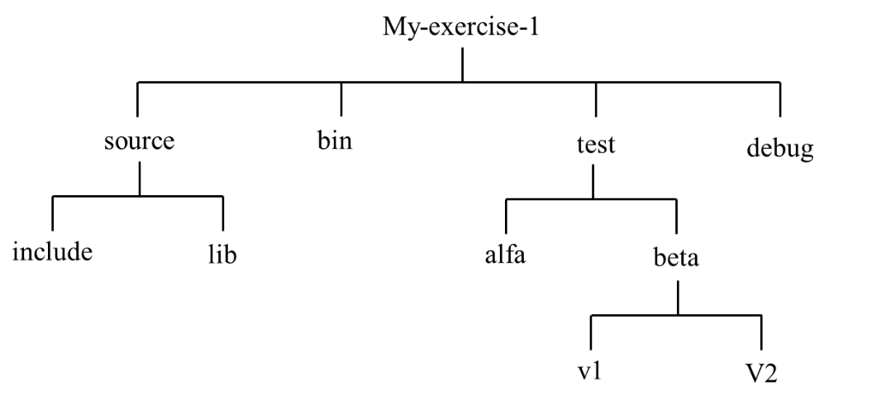

# OS Lab 01
Laboratory 01 of the Operating Systems course of the master degree in Embedded System (Electronic Engineering) of Politecnico di Torino, academic year 2019/2020. 

## Exercise 1
Create the following directory tree in your home using UNIX/Linux commands.

  

## Exercise 2
Use an editor to create a file with the name "edit.txt" and write 5 lines and save the file at "My_exercise_1/source".
Then, copy the file in "alfa" and "beta" directories using absolute and relative paths.
