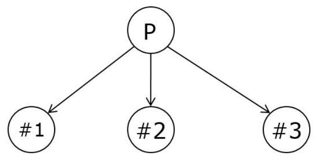
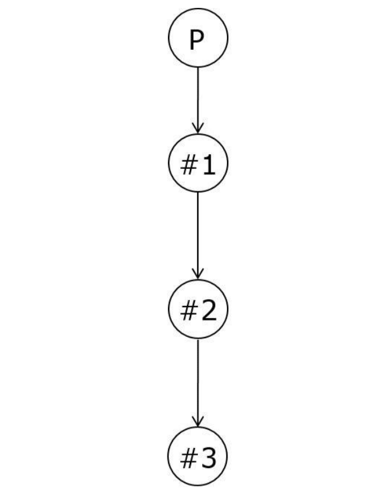

# OS Lab 02 - `fork()` - March 31th 2020
Laboratory 02 of the Operating Systems course of the master degree in Embedded System (Electronic Engineering) of Politecnico di Torino, academic year 2019/2020. 

## Exercise 1
Write a C program that creates a child process using the `fork()` system call.
The child process must print its PID, whereas the parent process must print both its PID and the PID of the child.

## Exercise 2
Write a C program that creates 3 processes as the following model.

  

## Exercise 3
Write a C program that creates 3 processes as the following model.

  

